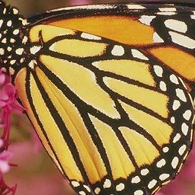

# SRCNN_Cpp
This project is an open source project of **"C++ Implementation of Super-Resolution resizing with Convolutional Neural Network"**.

## latest update
* Pull request accepted from [SRCNN_OpenCV_GCC](https://github.com/rageworx/SRCNN_OpenCV_GCC), which has been verified in Linux environment with updated OpenCV 4. Original reporitory with OpenCV 3 has been archived in [V1.0.0](https://github.com/shuwang127/SRCNN_Cpp/tree/V1.0.0-2015) branch. Thanks for the contributions from [rageworx](https://github.com/rageworx).
* OpenCV 4 compatibility updated.
* Supporting macOS universal binary.

## Non-OpenCV models
OpenCV is too large for specific applications, you may need the following two non-OpenCV models in some cases. 
* **libsrcnn** is a stand-alone non-OpenCV library, with 4 times more faster than OpenCV model: [rageworx/libsrcnn](https://github.com/rageworx/libsrcnn).
* **stb-image-srcnn** is an [stb](https://github.com/nothings/stb)-based non-OpenCV library: [zvezdochiot/stb-image-srcnn](https://github.com/ImageProcessing-ElectronicPublications/stb-image-srcnn).

### Introduction
This is an open source project from original of this:
**SRCNN_Cpp** is a C++ Implementation of Image Super-Resolution using SRCNN which is proposed by Chao Dong in 2014.
 - If you want to find the details of SRCNN algorithm, please read the paper:  

   Chao Dong, Chen Change Loy, Kaiming He, Xiaoou Tang. Learning a Deep Convolutional Network for Image Super-Resolution, in Proceedings of European Conference on Computer Vision (ECCV), 2014
 - If you want to download the training code(caffe) or test code(Matlab) for SRCNN, please open your browse and visit http://mmlab.ie.cuhk.edu.hk/projects/SRCNN.html for more details.
 - And thank you very much for Chao's work in SRCNN.

### What changed ?
1. Code modification from original [SRCNN](https://github.com/shuwang127/SRCNN_Cpp/tree/V1.0.0-2015).
1. OpenMP parallel processing, improved performance.
1. Supports almost of platform - POSIX compatibled.
    - MSYS2 and MinGW-W64
    - GCC of Linux
    - LLVM or CLANG of macOS, suporting universal binary build.

### License
The repo is released under the GPL v2 License (refer to the LICENSE file for details).

### Example
- Origin:

      

- Bicubic interplation x1.5

    

- SRCNN x1.5

      

### Requirements
1. Windows may need [MSYS2](https://www.msys2.org/) and [MinGW-W64](https://github.com/msys2/msys2/wiki/MSYS2-installation).
1. You need to install latest version of *OpenCV* to your build environments,
   install opencv libraries into your system with one of these:
    - MSYS2: ```pacman -S /mingw-w64-x86_64-opencv```
    - Debian: ```sudo apt-get install libopencv-dev```
    - MacOS
        1. Before install Brew : 
        ```bash
        sudo xcode-select --install 
        sudo xcodebuild -license
        ruby -e "$(curl -fsSL https://raw.githubusercontent.com/Homebrew/install/master/install)"
        ```
        1. After installed Brew :
        ```bash
        brew update
        brew install opencv4
        ```
1. Manual staic build OpenCV [Refer to [OpenCV Installation](https://docs.opencv.org/3.4/d7/d9f/tutorial_linux_install.html)]
    - Clone or download OpenCV source to you base level directory of this sources.
    ```bash
    cd ~/<my_working_directory>
    git clone https://github.com/opencv/opencv.git
    git clone https://github.com/opencv/opencv_contrib.git
    ```
    - Go to opencv, then make a 'build' directory.
    ```bash
    cd ~/opencv
    mkdir build
    cd build
    cmake -D CMAKE_BUILD_TYPE=Release -D CMAKE_INSTALL_PREFIX=/usr/local ..
    make -j8 # runs 8 jobs in parallel
    sudo make install
    ```
    - In case of MSYS2 Makefile, type like this.
    ```
    cmake -G "MSYS Makefiles" -DBUILD_SHARED_LIBS=OFF -DENABLE_PRECOMPILED_HEADERS=OFF -DWITH_IPP=OFF -DWITH_TBB=OFF -DWITH_FFMPEG=OFF -DWITH_MSMF=OFF -DWITH_VFW=OFF -DWITH_OPENMP=ON ..
    ```      
    - This project doesn't using video decoding, and there's too many erorrs occurs on Video processing source in OpenCV ( damn sucks cmake options, they're useless )


### Compile and Use
You can compile the C/C++ files on the command line in your POSIX shell. 

```bash
make
```
If the compile is successful, you will see linked binary in 'bin' directory.

```bash
./bin/srcnn ./Pictures/test.jpg 
```

The generated image will be `./Pictures/test_resized.jpg`.


